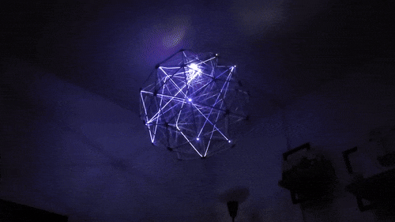

# Network activity visualizer
This project is a 3D printed [geodesic dome](https://en.wikipedia.org/wiki/Geodesic_dome) hooked up with flashing LEDs and fiber optic cables to visualize the nearby network activity, it looks pretty cool in the dark.

I used an ESP-32 in promiscuous mode to sniff WiFi packets and get their MAC addresses, and 40 individually addressable LEDs that flash when a packet is detected.
## How
To assemble the geodesic sphere, I printed 30 x hexagonal joints and 12 x pentagonal joints. They are joined with 3/16" wooden dowels, cut 60 dowels 155 mm long and 60 dowels 164 mm long.

The 3D files can be found on my thingiverse [here](https://www.thingiverse.com/thing:6896625). I used ~75 m of [1.5 mm side glow fiber optic cable](https://www.aliexpress.com/item/32807597828.html?spm=a2g0o.order_list.order_list_main.36.3d891802ASmCDw), each fiber optic cable is connected to the PCB holder, onto each LED, then routed around the 3D printed joints to create a web pattern. The fiber optics are held in place with crazy glue.

The KiCad PCB schematics can be found in `pcb.zip`, I had it made with JLC PCB.

On the board I soldered 40 x SMD5730 white LEDs, these are controlled by 5 x TLC5916 LED sink drivers. The TLC5916s are controlled by a Raspberry Pi.

The Pi and the TLC5916s are powered by a 5V wall power adapter, that power is also used by a buck converter to bring it down to 3.2 V for the LEDs.

The code for the ESP-32 can be found in `./wifiSniffer/WifiSniffer.ino`, the code is from [ESP-EOS/ESP32-WiFi-Sniffer](https://github.com/ESP-EOS/ESP32-WiFi-Sniffer). The ESP-32 is connected to the Raspberry Pi by USB, it prints detected WiFi packets to serial, and the Python script on the Raspberry Pi reads it.

After connecting the ESP-32 to the Pi and running `main.py` the intercepted packets will print in the terminal 

And that's it, enjoy the light show!

